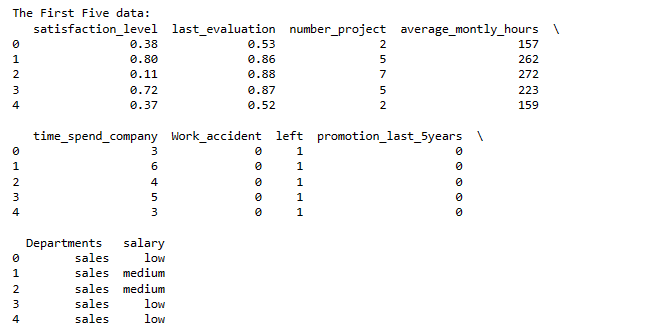
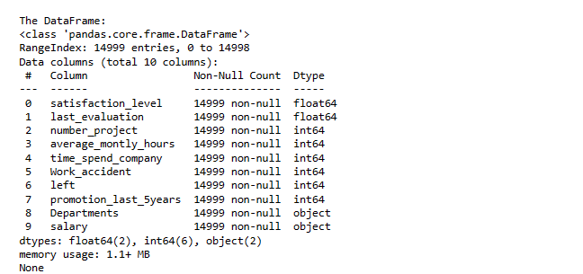
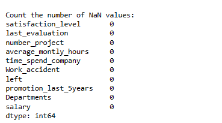
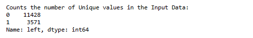
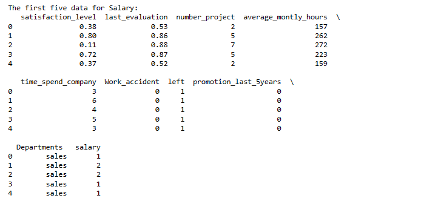
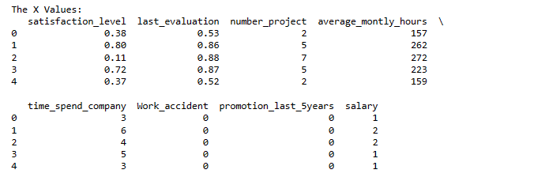
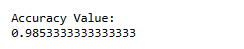
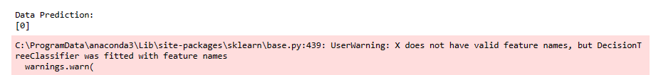

# EX 06:Implementation-of-Decision-Tree-Classifier-Model-for-Predicting-Employee-Churn

## DATE:

## AIM:
To write a program to implement the Decision Tree Classifier Model for Predicting Employee Churn.

## Equipments Required:
1. Hardware – PCs
2. Anaconda – Python 3.7 Installation / Jupyter notebook

## Algorithm
1. Import pandas module and import the required data set.
2. Find the null values and count them.
3. Count number of left values.
4. From sklearn import LabelEncoder to convert string values to numerical values.
5. From sklearn.model_selection ,import train_test_split.
6. Assign the train dataset and test dataset.
7. From sklearn.tree import DecisionTreeClassifier.
8. Use criteria as entropy.
9. From sklearn import metrics.
10. Find the accuracy of our model and predict the require values.

## Program:
```python
/*
Program to implement the Decision Tree Classifier Model for Predicting Employee Churn.
Developed by: VENKATANATHAN P R
Register Number:  212223240173
*/
import pandas as pd
data=pd.read_csv("Employee.csv")
print("\nThe First Five data:")
print(data.head())
print("\nThe DataFrame:")
print(data.info())
print("\nCount the number of NaN values:")
print(data.isnull().sum())
print("\nCounts the number of Unique values in the Input Data:")
print(data["left"].value_counts())

from sklearn.preprocessing import LabelEncoder
le=LabelEncoder()
data["salary"]=le.fit_transform(data["salary"])
print("\nThe first five data for Salary:")
print(data.head())
x=data[['satisfaction_level', 'last_evaluation', 'number_project', 'average_montly_hours', 'time_spend_company', 'Work_accident', 'promotion_last_5years', 'salary']]
print("\nThe X Values:")
print(x.head())
y=data["left"]

from sklearn.model_selection import train_test_split
x_train,x_test,y_train,y_test=train_test_split(x,y,test_size=0.2,random_state=100)
from sklearn.tree import DecisionTreeClassifier
dt=DecisionTreeClassifier(criterion="entropy")
dt.fit(x_train,y_train)
y_pred=dt.predict(x_test)

from sklearn import metrics
accuracy=metrics.accuracy_score(y_test,y_pred)
print("\nAccuracy Value:")
print(accuracy)

print("\nData Prediction:")
print(dt.predict([[0.5,0.8,9,260,6,0,1,2]]))

```

## Output:

### The First five Data:




### Data Frame:



### Count the number of NaN values:



### Counts the number of Unique values in the Input Data:



### The first five data for Salary:



### The X values:



### Accuracy Value:



### Data Prediction:



## Result:
Thus the program to implement the  Decision Tree Classifier Model for Predicting Employee Churn is written and verified using python programming.
